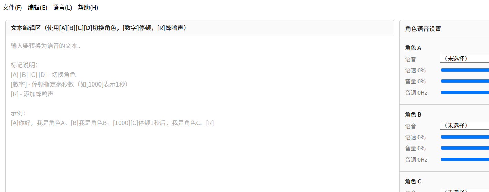

# edge-tts-roles

**Edge-TTS 多角色音频生成器**——基于在线微软 Edge TTS 语音服务，将带标记的文本脚本转换为多人配音音频的桌面应用。基于 Electron + Vue 3 + TypeScript 构建。

[](https://github.com/pollybird/edge_tts_roles_electron/stargazers)
[](./LICENSE)
[](https://github.com/pollybird/edge_tts_roles_electron/releases/latest)
[](https://github.com/pollybird/edge_tts_roles_electron/actions)

[English](./README.md) | 简体中文

> 如果这个项目对你有帮助，请在 GitHub 上 ⭐ **点个 Star**——你的支持是项目持续维护的动力。

只需在纯文本脚本中使用轻量标记（`[A]`、`[B]`、`[1000]`、`[R]`），为四个角色分别指定不同的神经网络发音人，应用即可逐段合成语音，拼接停顿与蜂鸣声，并可选择性混入前奏 / 尾声 / 背景音乐，最终导出 WAV / MP3 / OGG / FLAC 音频文件。

> 语音合成本身由微软 Edge 在线语音服务提供，**使用时需要联网**。

## 产品截图



## 功能特性

- **四个可切换的说话角色（A–D）**——每个角色可独立配置神经网络发音人、语速、音量和音调。
- **标记式脚本格式**——不离开文本即可切换发音人、插入精确到毫秒的停顿和蜂鸣声。
- **完整 Edge TTS 音色库**——音色列表从服务端获取，按语言分组并显示本地化名称。
- **长文本可靠生成**——网络中断时每个片段自动重试（最多 15 次），内置连接空闲看门狗与自适应退避；已完成片段写入磁盘缓存，失败后重新生成可从断点续跑。
- **附加音频（v2.0.0）**——可选择本地音频文件作为**前奏**、**尾声**和**背景音乐**，每路支持独立的 0–100% 音量调节；背景音乐自动循环铺满整段语音。
- **即时试听**——导出前可在内置播放器中试听全部文本或仅试听选中文本（试听同样包含附加音频混音）。
- **四种导出格式**——WAV（32 位浮点）、MP3、OGG Vorbis、FLAC，全部通过内置的 ffmpeg 二进制处理，无需系统安装 ffmpeg。
- **音色配置导入/导出**——可将四个角色的发音人 / 语速 / 音量 / 音调保存为 JSON 配置文件，在不同脚本间复用。
- **编辑器辅助功能**——查找替换、一键插入标记、快速停顿按钮、实时字数统计、文本文件打开/保存。
- **内置 9 种语言**——英语、简体中文、繁体中文、法语、德语、西班牙语、俄语、日语、阿拉伯语（支持 RTL 布局），界面自动跟随系统语言。
- 程序启动时窗口默认最大化。

## 标记语法

| 标记                    | 含义                                   |
| ----------------------- | -------------------------------------- |
| `[A]` `[B]` `[C]` `[D]` | 从此处起切换为角色 A / B / C / D       |
| `[1000]`                | 插入 `1000` 毫秒的停顿（任意整数均可） |
| `[R]`                   | 插入一段 500ms / 1000Hz 的蜂鸣声       |

首个角色标记之前的文本默认由角色 A 朗读。

```
[A]你好，我是角色 A。[B]我是角色 B。[1000][C]停顿 1 秒后，角色 C 出场。[R]
```

## 使用指南

1. **分配发音人**——在右侧「角色语音设置」中，为脚本中用到的每个角色选择神经网络发音人，并按需调整语速 / 音量 / 音调。
2. **编写脚本**——在编辑器中输入或粘贴文本，使用工具栏按钮插入角色标记、停顿和蜂鸣声。
3. **（可选）添加附加音频**——在发音人设置下方的「附加音频」面板中，分别为前奏 / 尾声 / 背景音乐选择本地文件，并拖动各路音量滑块（0–100%）。
   - 前奏在语音之前播放，尾声在语音之后播放；
   - 背景音乐叠加在语音下方，时长不足时自动循环。
4. **试听**——使用「试听选中文本」/「试听全部文本」在内置播放器中预听效果。
5. **导出**——在底部选择输出格式和保存路径，点击「生成音频」。生成过程逐段显示进度，可随时停止。

附加音频支持格式：MP3、WAV、OGG、FLAC、M4A、AAC、OPUS、WMA（即内置 ffmpeg 可解码的格式）。混音结果统一硬限幅到 ±1.0，防止爆音。

## 键盘快捷键

| 快捷键                 | 功能                 |
| ---------------------- | -------------------- |
| `Ctrl/Cmd + O`         | 打开文本文件         |
| `Ctrl/Cmd + S`         | 保存文本             |
| `Ctrl/Cmd + Shift + O` | 加载音色配置（JSON） |
| `Ctrl/Cmd + Shift + S` | 保存音色配置（JSON） |
| `Ctrl/Cmd + F`         | 查找                 |
| `Ctrl/Cmd + H`         | 替换                 |
| `F1`                   | 帮助                 |

## 工作原理

1. **解析**——脚本被拆分为文本 / 停顿 / 蜂鸣片段（[textParser.ts](./src/shared/textParser.ts)）。
2. **合成**——每个文本片段以 MP3 流式方式从 Edge TTS 获取。每段设有空闲看门狗（15 秒）识别僵死连接；失败时最多重试 15 次并采用带抖动的退避策略；每个成功片段写入磁盘缓存（`userData/tts-segment-cache`，按 LRU 淘汰）。
3. **解码与组装**——各片段通过内置 ffmpeg 解码为 24kHz 双声道 32 位浮点 PCM，再与生成的静音和蜂鸣音顺序拼接。
4. **混合附加音频**——前奏/尾声按音量缩放后顺序拼接；背景音乐按音量缩放、循环至语音长度后叠加，统一做 ±1.0 限幅。
5. **编码输出**——WAV 直接写入；MP3 / OGG / FLAC 通过 ffmpeg 编码（`libmp3lame`、`libvorbis`、`flac`）。

## 项目结构

```
src/
├── main/                 Electron 主进程
│   ├── index.ts          应用生命周期、默认最大化主窗口
│   ├── ttsService.ts     合成管线：重试、缓存、附加音频混音
│   ├── audioProcessor.ts PCM 运算 + ffmpeg 编解码（24kHz 双声道 f32）
│   ├── ipc.ts            IPC 处理、文件对话框、配置导入导出
│   ├── menu.ts           本地化应用菜单
│   └── settings.ts       electron-store 配置 schema
├── preload/
│   └── index.ts          经 contextBridge 暴露为 window.api
├── renderer/             Vue 3 渲染进程
│   └── src/
│       ├── App.vue
│       ├── components/   TextEditor、RoleSettings、AudioExtrasPanel、
│       │                 OutputPanel、PreviewDialog
│       └── composables/  useI18n
└── shared/               主进程与渲染进程共享代码
    ├── types.ts          请求/响应类型与 IPC 契约
    ├── ipc.ts            IPC 通道名
    ├── textParser.ts     标记解析器
    ├── voiceGroups.ts    音色分组与排序
    └── i18n/             i18n 核心与 7 个语言包
```

## 技术栈

- [Electron](https://www.electronjs.org/) 39 + [electron-vite](https://electron-vite.org/) 5
- [Vue](https://vuejs.org/) 3.5（组合式 API，`<script setup>`）+ TypeScript 5.9
- [edge-tts-universal](https://www.npmjs.com/package/edge-tts-universal)——Edge TTS 客户端
- [ffmpeg-static](https://www.npmjs.com/package/ffmpeg-static)——内置 ffmpeg 二进制
- [electron-builder](https://www.electron.build/)——打包（NSIS / DMG / AppImage、snap、deb）
- electron-store——带类型的本地配置存储

## 开发指南

### 环境要求

- Node.js `^20.19 || >=22.12`（推荐 LTS 版本）
- npm
- 合成时需能访问微软 Edge TTS 服务的网络环境

### 安装与运行

```bash
npm install
npm run dev
```

### 类型检查与代码规范

```bash
npm run typecheck   # tsc（主进程/preload）+ vue-tsc（渲染进程），仅检查不输出
npm run lint
npm run format
```

### 生产构建

```bash
npm run build            # 类型检查 + electron-vite 构建（产物输出到 out/）
npm run build:unpack     # 输出解包版应用到 dist/（便于本地快速验证）
npm run build:linux      # Linux x64 + arm64：AppImage、deb、rpm
npm run build:win        # Windows x64 + arm64：NSIS 安装包
npm run build:mac        # macOS x64 + arm64：DMG + ZIP（需在 macOS 上运行）
npm run build:mac:zip    # 仅 macOS x64 + arm64 ZIP（可在 Linux/Windows 上交叉产出）
npm run build:all        # 依次执行 linux + win + mac:zip（CI 发版使用）
```

各平台脚本会自动先执行 `prepare:ffmpeg`，下载**全部**目标平台的 FFmpeg 二进制（Linux x64/arm64、Windows x64、macOS x64/arm64，合计约 320MB）到 `resources/ffmpeg/`（已被 git 忽略）。二进制与 ffmpeg-static 同源同版本（release `b6.1.1`，GPL 构建），打包时由 electron-builder 放入 `resources/ffmpeg/<platform>-<arch>/`，应用运行时按当前平台选择对应文件。GitHub 较慢时可用环境变量 `FFMPEG_BINARIES_URL` 指定镜像（脚本也会自动回退到 npmmirror 二进制镜像）。

### 自动更新

应用启动 5 秒后自动检查更新，也可通过菜单 **帮助 → 检查更新** 手动触发。

- **主更新源**：[GitHub Releases](https://github.com/pollybird/edge_tts_roles_electron/releases)（`/releases/latest/download/latest*.yml`）。
- **回退源**：GitCode Release 附件。若 GitHub 在 3.5 秒内不可达，应用先调用 GitCode 公开 API（`/api/v5/repos/<owner>/<repo>/releases/latest`，免认证）解析最新 Release 的 tag，再以 `/releases/download/<tag>/` 作为 feed base 拉取同名附件（GitCode 不支持 GitHub 的 latest 别名，仓库 raw 地址对缺失文件会返回 HTML，均不可直接用作 feed）。

#### 自动发版（GitHub Actions，推荐）

1. 推送 `v*` 标签触发 [release 工作流](./.github/workflows/release.yml)：单台 Linux Runner 执行 `npm run build:all` 完成三平台双架构打包，并把全部安装包、blockmap 与三个 `latest*.yml`（共 17 个附件）发布到 GitHub Release。
2. 在仓库 **Settings → Secrets and variables → Actions** 配置 `GITCODE_TOKEN` 后，工作流会自动把该标签推送到 GitCode 并运行 `scripts/publish-gitcode.mjs` 镜像全部附件（已存在的同名附件会跳过——GitCode 不支持 API 删除/覆盖）。
3. Gitee 受单附件 100MB 限制，仍需手动创建仅含源码包的 Release，并在说明中引导到 GitHub/GitCode 下载。
4. Release 的中英发布说明需在发布后在各平台网页补充（Gitee 仅中文）。推送到 main 的每次提交与 PR 会由 [ci 工作流](./.github/workflows/ci.yml) 自动执行 typecheck / lint / 单元测试。

也可在 Actions 页面对**已有标签**手动重跑 release 工作流以补传缺失附件。本地手动发版（无 CI 时）仍可依次执行 `build:linux`、`build:win`、`build:mac:zip`，再以 `GITCODE_TOKEN=xxx npm run release:gitcode` 镜像到 GitCode。

`electron-builder.yml` 已配置 `publish.provider: github`；执行 `electron-builder --publish always`（需 `GH_TOKEN`）亦可直接上传产物到 GitHub Releases（本仓库打包脚本统一使用 `--publish never`，以避免 CI 环境误触发）。

平台说明：

- 原生安装包原则上需在对应系统上构建。Linux 主机可以构建 Linux 安装包、Windows NSIS 安装包（electron-builder 会自动使用 Wine）以及 macOS ZIP 压缩包，但**生成 DMG 必须在 macOS 上**；需要 macOS 公证或 Windows 代码签名时，请在对应系统执行。
- Windows NSIS 为辅助式（非一键）安装器，安装向导会展示完整的 **GNU AGPL v3 许可协议页**，并允许用户选择安装目录。
- Windows on ARM 没有官方原生 FFmpeg 构建：arm64 安装包内附带的是 x64 版 `ffmpeg.exe`，借助 Windows 11 on ARM 内置的 x64 模拟运行；若缺失则回退使用系统 PATH 中的 ffmpeg。
- `npm run build` 会在打包前对两个 TypeScript 工程执行开启了 `noUnusedLocals` / strict 的严格检查，是最权威的校验命令。开发环境无需自行安装 ffmpeg——执行 `npm install` 时 ffmpeg-static 会自动下载当前平台的二进制。

## 国际化

全部界面文案位于 [src/shared/i18n/locales](./src/shared/i18n/locales) 下的类型化语言包：英语（基准/兜底）、简体中文、繁体中文、法语、德语、西班牙语、俄语、日语、阿拉伯语。首次启动默认跟随系统语言；用户在主菜单 **语言(L)** 中的选择会持久化保存并在重启后应用。缺失的 key 会自动回退英语。新增语言只需新增一个语言包并在 `src/shared/i18n/index.ts` 与 `availableLocales()` 中登记。

## 许可证

本项目基于 **GNU Affero 通用公共许可证 v3.0（AGPL-3.0-only）** 发布，完整协议文本见 [LICENSE](./LICENSE)。

本程序按"现状"分发，不提供任何明示或暗示的担保（包括但不限于适销性、特定用途适用性的默示担保），详见 GNU AGPL 协议条款。

由于本应用链接了使用 AGPL-3.0 协议的 [edge-tts-universal](https://www.npmjs.com/package/edge-tts-universal)，应用整体按 AGPL 发布；同时通过 ffmpeg-static 内置了 GPL 构建版 [FFmpeg](https://ffmpeg.org/)（GPL-3.0-or-later），其对应源码可在 <https://ffmpeg.org/download.html#get-sources> 获取。其他主要组件：Electron、Vue.js、electron-store、@electron-toolkit/\*、Vite、electron-vite（均为 MIT）以及 TypeScript（Apache-2.0）。完整署名清单可在应用内「帮助 → 关于」中查看。

## 版权信息

版权所有 © 2026 泰州市姜堰钟毓信息科技有限公司（https://www.tzzhy.cn/）。保留一切权利。

语音合成由微软 Edge 在线语音服务提供。本项目为独立客户端，与微软公司不存在任何隶属、赞助或背书关系。
